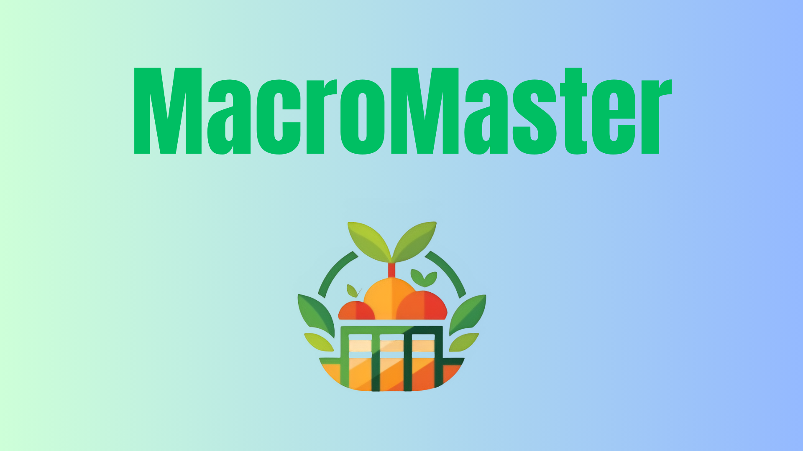
 
 
 # MacroMaster

**MacroMaster** is a decoupled **Django + React** web application designed to track calories, manage nutrition, and foster community engagement. The platform combines a modern frontend with a powerful backend to deliver real-time updates, advanced analytics, and an intuitive user experience.

---

## Features

- **Nutrition Tracking:** Log daily calorie intake and set nutrition goals.
- **Interactive Dashboards:** Visualize data with charts and graphs for insights.
- **Authentication & Security:** Secure account management with JWT.
- **Real-Time Updates:** Instant updates using WebSockets.
- **User Onboarding:** Guided onboarding for new users.
- **Responsive Design:** Optimized for both mobile and desktop.
- **Community Forum:** Engage in discussions and share tips.
- **Animated & Interactive UI:** Smooth animations and dynamic components.

---

## Tech Stack

### Frontend
- React (with SWC and JavaScript)
- Redux for state management
- Tailwind CSS for styling

### Backend
- Django REST Framework (DRF)
- Celery for background tasks
- JWT authentication
- WebSockets for real-time communication

### Other Tools
- PostgreSQL (or preferred database)
- Docker (optional, for containerization)

---

## Screenshots

### Web Pages
| About Page | Account Home | Careers Animation | Features Page |
|------------|--------------|-----------------|---------------|
| 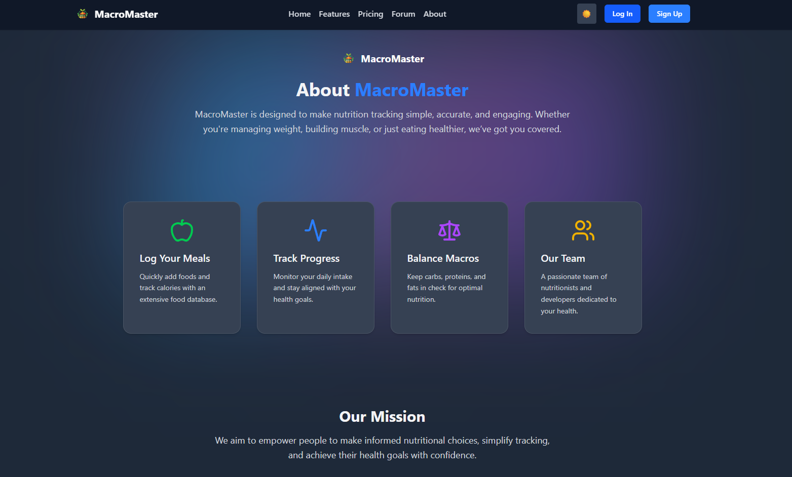 | 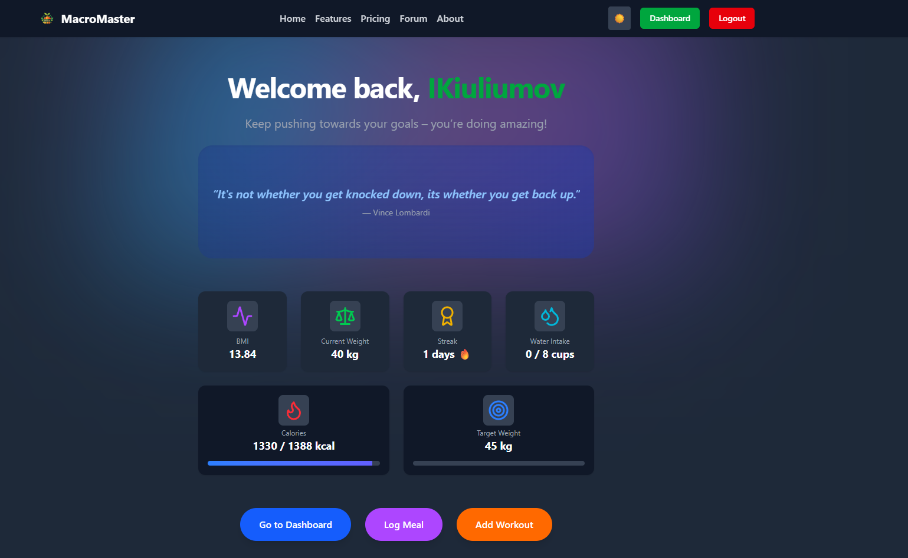 | 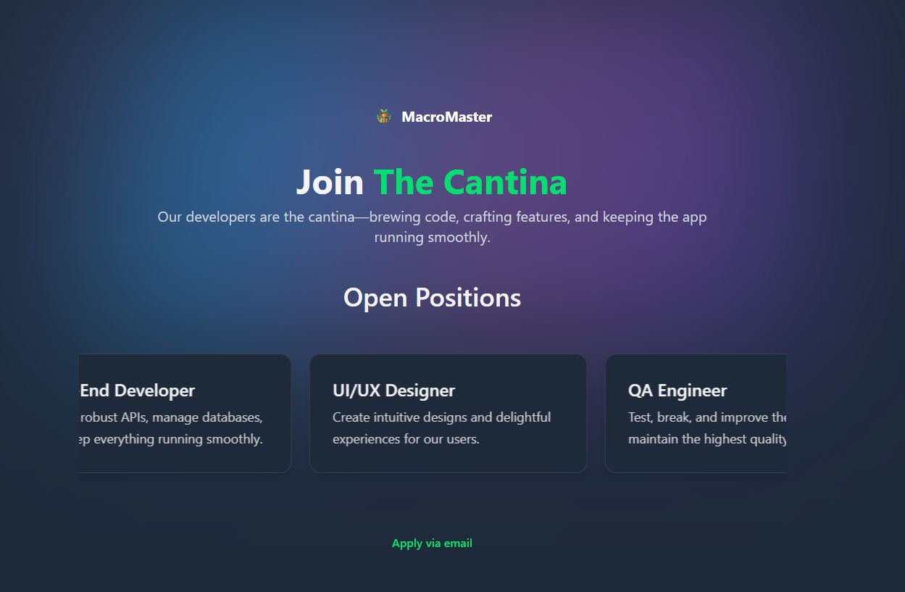 | 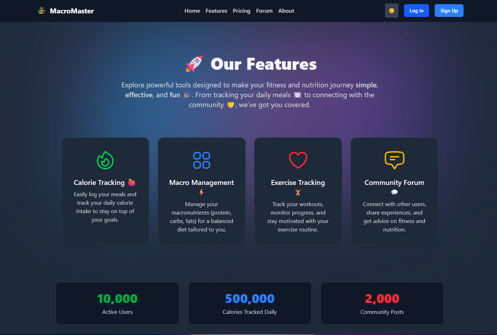 |

### UI Components
| Footer Section | Light Mode Home | Login Form | Mobile Home |
|----------------|----------------|------------|-------------|
|  | 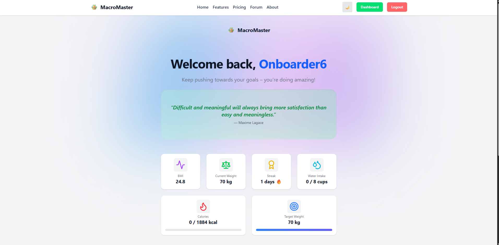 | 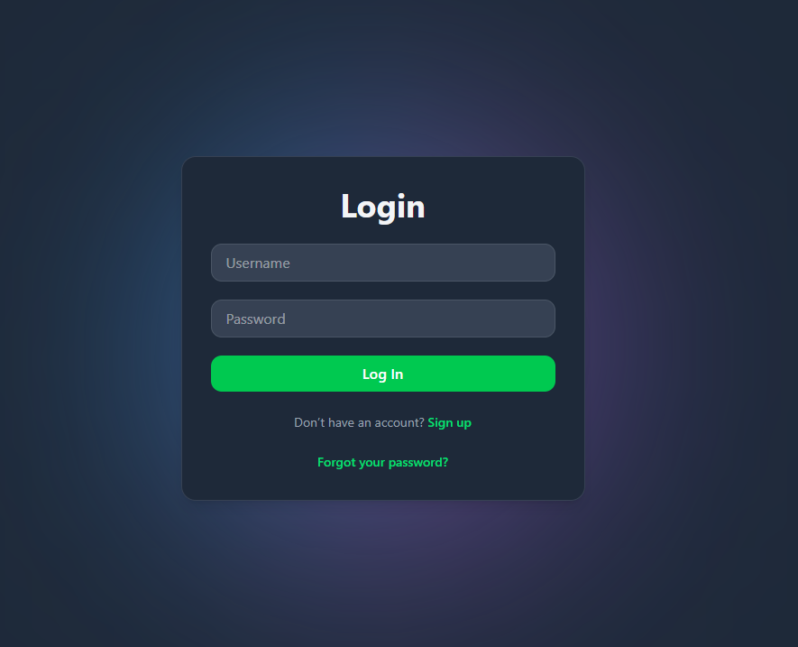 | 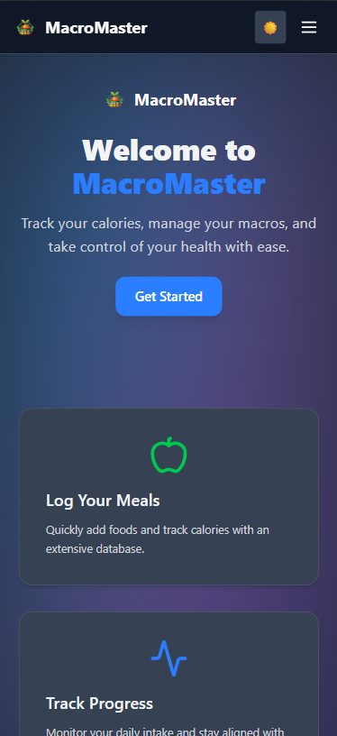 |

### Mobile Views
| Mobile Navigation | No Account Home | Onboarding Step 1 | Onboarding Step 2 |
|-----------------|----------------|-----------------|-----------------|
| 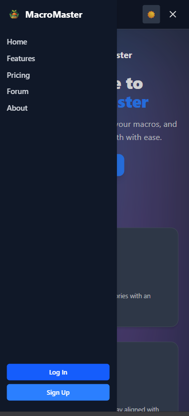 | 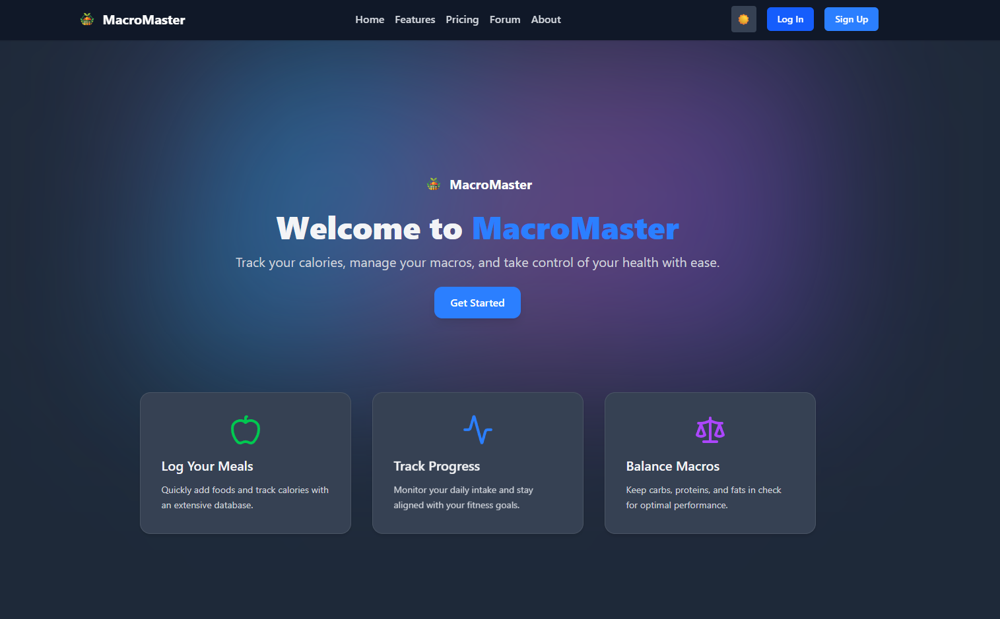 | 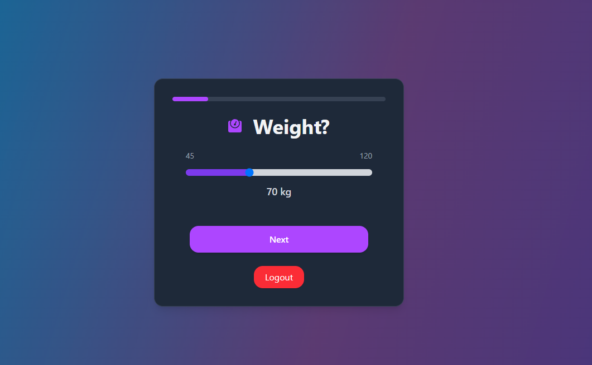 | 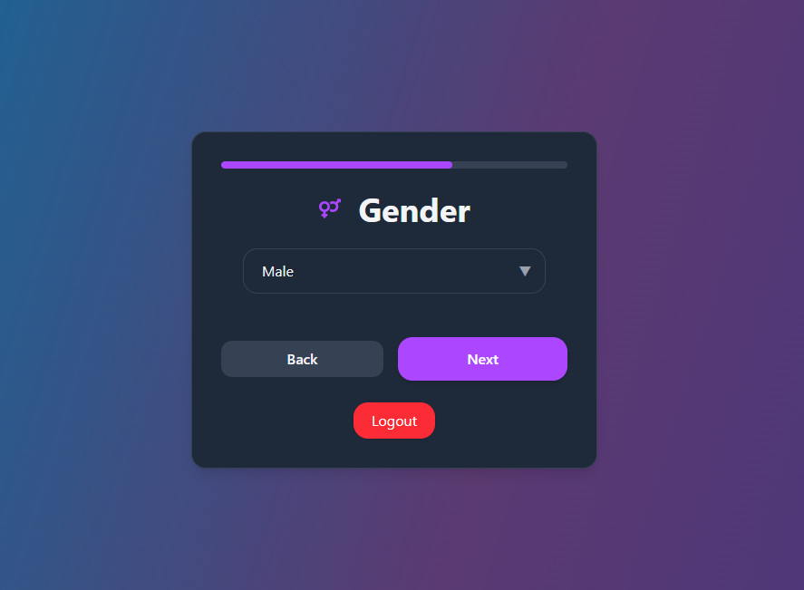 |

### Forms & Support
| Pricing Plans | Register Form | Support Page |
|---------------|---------------|--------------|
| 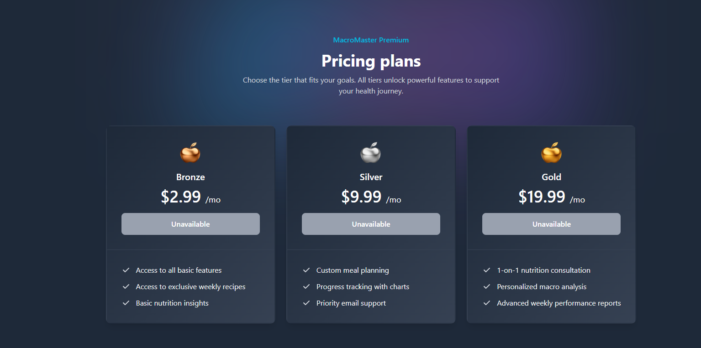 | 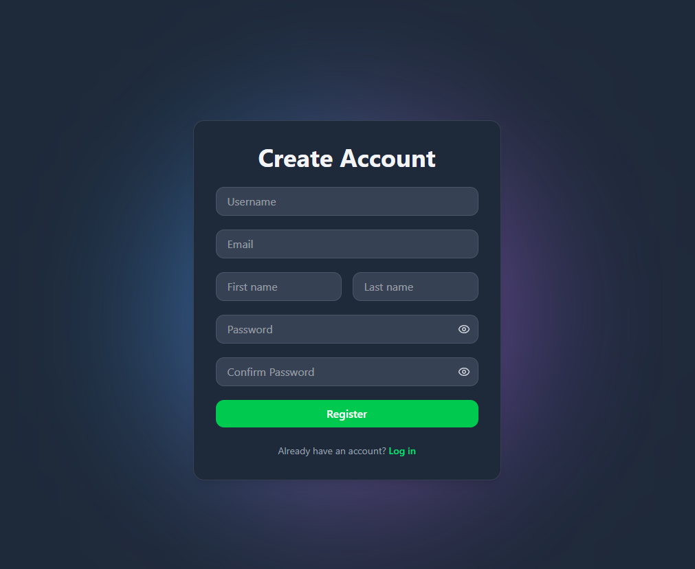 | 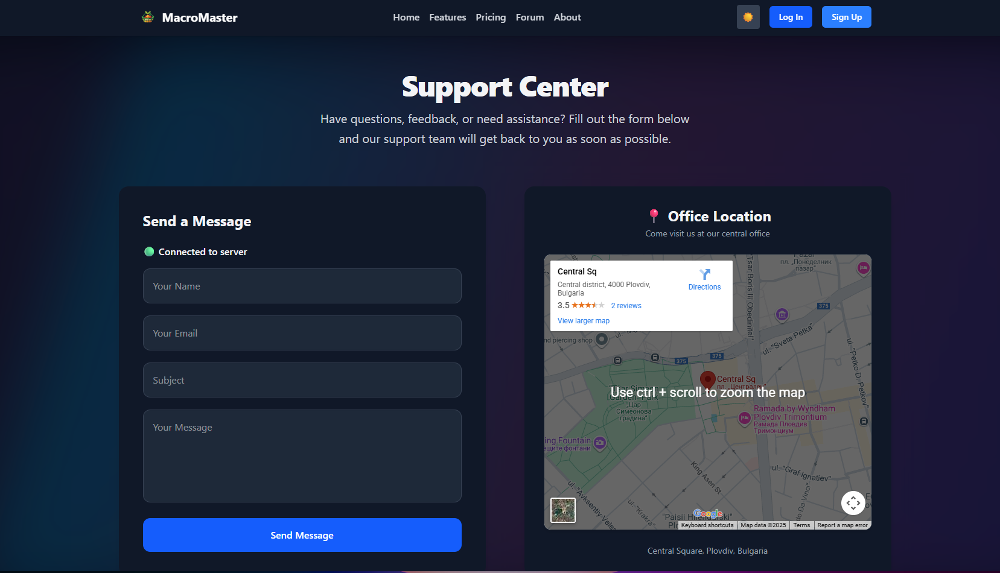 |

